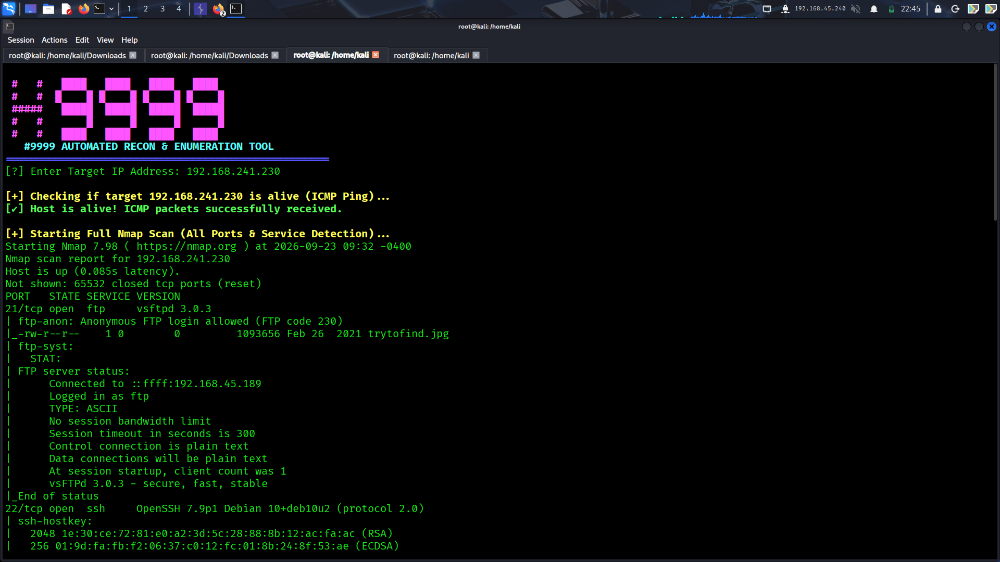

<p align="center">
  <h1 align="center">🐉 Advanced Recon Suite (AutoRecon-999)</h1>
</p>

<p align="center">
  <b>An advanced, automated, and lightning-fast reconnaissance tool built in Bash for cybersecurity professionals and penetration testers.</b>
</p>

<p align="center">
  
  
  
</p>

---

## 🚀 Overview

**AutoRecon-999** is a powerful automation script designed to streamline and accelerate the initial information-gathering and enumeration phase during penetration testing and bug bounty hunting. 

Manual reconnaissance can be tedious and time-consuming. This tool chains multiple industry-standard security utilities into a seamless, automated workflow. Once you provide a target IP address, the tool intelligently executes live host detection, deep port scanning, service version analysis, automated anonymous FTP checks, and recursive web directory fuzzing without requiring constant manual intervention. It acts as an all-in-one recon companion that handles the heavy lifting, allowing security analysts to focus straight on vulnerability assessment and exploitation.

---

## ✨ Features

- **Live Host Discovery:** Automatically sends ICMP packets to verify if the target host is active and reachable over the network.
- **Deep Port Enumeration:** Executes comprehensive Nmap scans to map out all open ports, running services, and underlying OS details.
- **Automated FTP Vulnerability Checks:** Detects open FTP ports and instantly attempts an Anonymous Login to check for misconfigurations, while analyzing service versions for potential exploits.
- **Smart Web Fuzzing (Gobuster):** Automatically identifies if HTTP (Port 80) or HTTPS (Port 443) services are active and launches high-speed directory fuzzing using Gobuster to uncover hidden web paths.
- **Structured Workflow:** Designed cleanly for terminal outputs with color-coded alerts to easily spot critical findings.

---

## 📥 Installation

*(Add your custom installation commands here once your script files are uploaded to the repository)*

```bash
# [YOUR INSTALLATION COMMANDS HERE]
# Example:
# git clone [https://github.com/NullByte999/AutoRecon-999.git](https://github.com/NullByte999/AutoRecon-999.git)
# cd AutoRecon-999
# chmod +x your-script.sh
